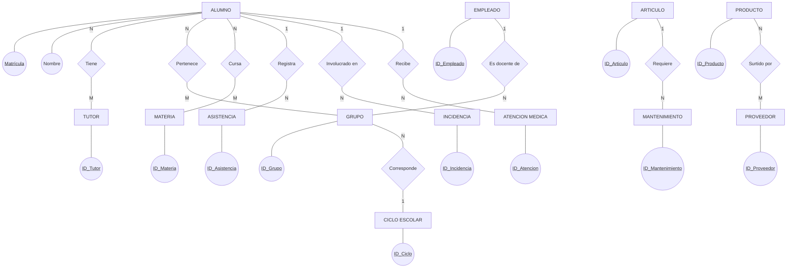
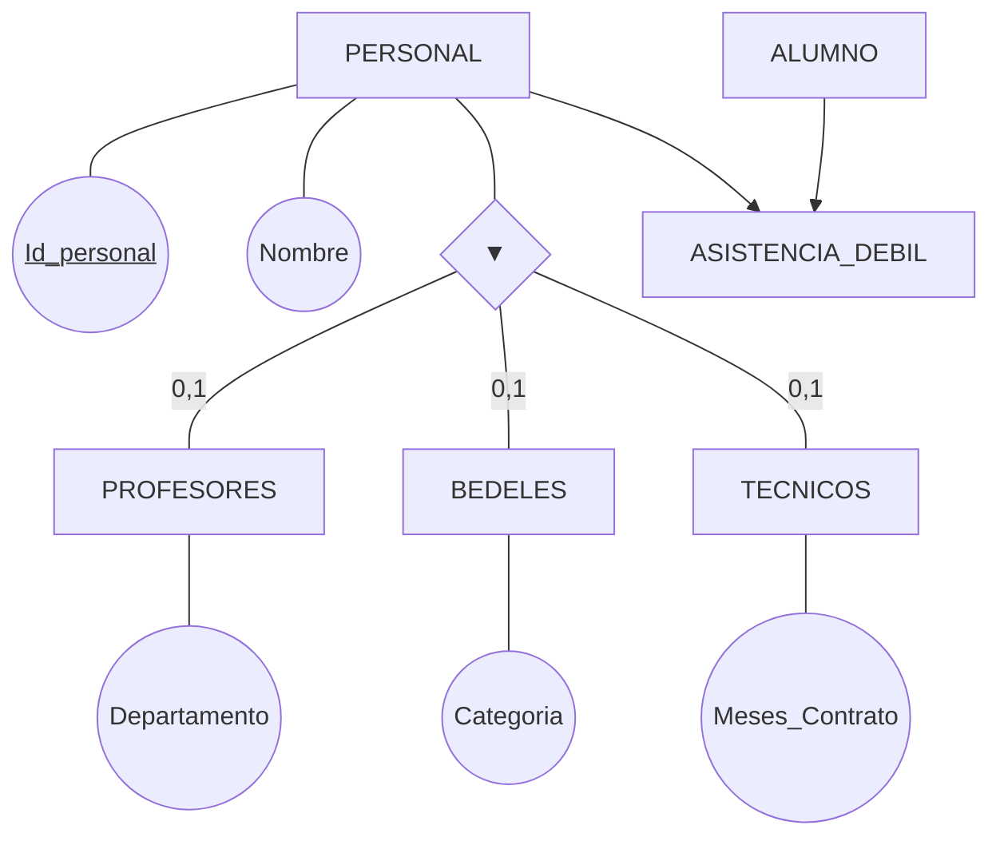
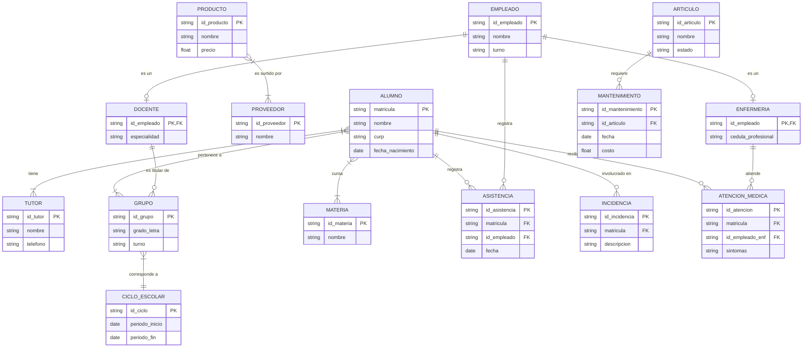

## 1. La Idea

**Qué problema atiende y para quién:**
El proyecto atiende la necesidad de centralizar, asegurar y automatizar la gestión operativa, académica y administrativa de una escuela primaria de gran volumen (seis grados, cinco grupos por grado y dos turnos, sumando cerca de 1,800 alumnos en total). Actualmente, el manejo de información mediante archivos independientes (como hojas de cálculo) genera inconsistencias graves (como cruces de horarios docentes), redundancia de datos y pérdida de información histórica al cambiar de ciclo escolar. El sistema está diseñado para el **Director** como herramienta global de control y toma de decisiones, y para el **personal operativo** (administrativos, docentes, enfermería, cafetería) mediante un modelo de seguridad basado en roles.

**De dónde salió la idea y la entrevista (Caso de Estudio):**
La idea surgió de una necesidad real detectada durante una extensa entrevista con el **Director de la escuela primaria**, quien fungiría como el usuario administrador del sistema. Durante la charla, nos describió detalladamente la complejidad operativa de la institución y nos exigió que el sistema no fuera "solo una tabla enorme", sino un modelo que respete las reglas y restricciones reales de la escuela.

**Desglose de la Entrevista (Qué nos dijo el Director):**
El Director nos dictó los siguientes requerimientos y reglas de negocio específicas que motivaron el diseño de la base de datos:

*   **Historial Inmutable por Ciclo Escolar:** Nos explicó que el avance de los alumnos no debe sobrescribir su pasado. El sistema debe conservar el historial académico, indicando en qué grupo, con qué profesor y qué calificaciones tuvo un alumno en los ciclos escolares anteriores.
*   **Gestión Compleja de Tutores:** Nos indicó que el diseño debe contemplar relaciones de muchos a muchos: un alumno puede tener varios tutores autorizados (para emergencias o salidas), y un mismo tutor puede tener varios hijos inscritos en distintos grados. El sistema debe evitar registrar al mismo padre varias veces.
*   **Regla de Negocio Estricta para Horarios Docentes:** Hizo mucho énfasis en los empalmes. Un profesor puede laborar en el turno matutino y vespertino, pero el sistema debe validar los horarios y bloquear automáticamente si se intenta asignar a un profesor a dos grupos distintos (ej. 4°A y 5°B) en el mismo día y exactamente a la misma hora.
*   **Control de Personal y Asistencias:** Nos pidió abarcar a toda la plantilla (administrativos, intendencia, mantenimiento, vigilancia). De todo el personal y de los alumnos se debe llevar un control estricto de asistencias, inasistencias, retardos y justificaciones.
*   **Módulos Operativos (Inventario y Cafetería):** Nos solicitó unificar la gestión física del plantel. Esto incluye un control de inventario de equipos (computadoras, proyectores) rastreando su estado, responsable y reportes/costos de mantenimiento. Asimismo, pidió un módulo para la cafetería que enlace proveedores, compras, registro de ventas y actualización de existencias en tiempo real.
*   **Gestión de Incidencias y Enfermería:** Solicitó poder registrar problemas disciplinarios (fecha, involucrados, reportador y seguimiento) y atenciones médicas dentro del plantel.
*   **Seguridad y Privacidad Sensible:** Fue categórico al exigir distintos niveles de acceso. Un maestro solo debe poder consultar a sus grupos, el personal de cafetería no debe acceder a expedientes académicos, y la información de enfermería debe mantenerse con un acceso sumamente restringido por la sensibilidad de los datos.

## 2. Modelo Entidad-Relación

**Entidades del Dominio:**
1. **Alumno:** (Matrícula, Nombre, CURP, Fecha_Nacimiento, Domicilio, Teléfono)
2. **Tutor:** (ID_Tutor, Nombre, Teléfono, Relación_Emergencia)
3. **Empleado:** (ID_Empleado, Nombre, Puesto, Área, Turno)
4. **Grupo:** (ID_Grupo, Grado, Letra, Salón, Turno)
5. **Ciclo Escolar:** (ID_Ciclo, Periodo_Inicio, Periodo_Fin)
6. **Materia:** (ID_Materia, Nombre)
7. **Asistencia:** (ID_Asistencia, Fecha, Estado, Justificación)
8. **Incidencia:** (ID_Incidencia, Fecha, Descripción, Seguimiento)
9. **Atención Médica:** (ID_Atencion, Fecha, Síntomas, Tratamiento)
10. **Artículo (Inventario):** (ID_Articulo, Nombre, Estado, Ubicación)
11. **Mantenimiento:** (ID_Mantenimiento, Fecha, Falla, Costo)
12. **Producto (Cafetería):** (ID_Producto, Nombre, Precio, Existencia)
13. **Proveedor:** (ID_Proveedor, Nombre, Contacto)

**Relaciones Principales y Cardinalidades:**
* **Alumno - Tutor (N:M):** Un alumno puede tener varios tutores autorizados, y un tutor puede tener varios hijos en la escuela.
* **Alumno - Grupo - Ciclo Escolar (N:M):** Un alumno pertenece a un grupo en un ciclo escolar determinado.
* **Empleado (Docente) - Grupo (1:N):** Un docente es responsable de uno o más grupos, validando que no haya cruce de horarios.
* **Alumno - Materia (N:M):** Un alumno cursa varias materias.
* **Alumno/Empleado - Asistencia (1:N):** Alumnos y empleados tienen múltiples registros de asistencia.
* **Alumno - Incidencia (1:N):** Un alumno puede estar en varias incidencias.
* **Alumno - Atención Médica (1:N):** Un alumno recibe múltiples atenciones.
* **Artículo - Mantenimiento (1:N):** Un artículo requiere varios mantenimientos históricos.
* **Producto - Proveedor (N:M):** Relación de surtido de cafetería.

**Diagrama ER Conceptual:**

## 3. Modelo Entidad-Relación Extendido (EER)

En esta fase incorporamos los atributos de cada entidad, definiendo claramente las Claves Primarias (PK) y Claves Foráneas (FK). Además, aplicamos los conceptos extendidos para representar la jerarquía y las dependencias lógicas, utilizando la notación Pata de Gallo (Crow's Foot) que facilita la transición al modelo relacional.

**A. Principios de Generalización y Especialización:**
*   **Generalización:** Proceso de abstracción mediante el cual se identifican características comunes entre varias entidades para agruparlas en una superentidad de nivel superior (ej. agrupar a Profesores, Bedeles y Técnicos en la superentidad `PERSONAL`).
*   **Especialización:** Proceso inverso de definición de subconjuntos especializados a partir de una superentidad, dotándolos de atributos y relaciones particulares de su área.

**B. Reglas de Uso en Relaciones ISA (Exclusividad y Solapamiento):**
*   **Exclusividad (Disyunción):** Una relación ISA es **exclusiva** si un ejemplar de la superentidad puede pertenecer a lo sumo a una sola de las subentidades. Gráficamente se representa con un arco que une las ramas que salen del triángulo ISA. En nuestro sistema, aplicamos exclusividad en el personal operativo: un empleado no puede desempeñar simultáneamente el rol de profesor y de personal de enfermería bajo la misma asignación contractual directa.
*   **Solapamiento (Overlapping):** Ocurre cuando un ejemplar de la superentidad puede pertenecer simultáneamente a dos o más subentidades de la jerarquía (no se dibuja el arco restrictivo).
*   **Totalidad vs. Parcialidad (Obligatoriedad):** 
    *   *Total (Obligatoria):* Todo ejemplar de la superentidad *debe* pertenecer obligatoriamente a al menos una de las subentidades.
    *   *Parcial:* Un ejemplar de la superentidad puede pertenecer o no a las subentidades. Nuestro modelo implementa una **relación ISA exclusiva y parcial**.

**C. Entidades Débiles:**
Son aquellas que no poseen atributos propios suficientes para conformar una clave primaria por sí mismas. Su existencia depende de una entidad fuerte a través de una relación de identificación (ej. `ASISTENCIA` o `MANTENIMIENTO`).

**Diagrama EER Conceptual con Jerarquía ISA:**

4. Modelo Relacional (Esquema de Tablas)
A partir del modelo EER y aplicando formalmente las reglas de paso a tablas físicas:

Las relaciones de muchos a muchos (N:M) se resolvieron creando tablas intermedias (entidades asociativas).

La jerarquía ISA se implementó propagando la clave primaria de la superentidad Personal hacia las tablas de las subentidades (Profesores, Bedeles, Tecnicos).

Las entidades débiles incorporaron la clave primaria de su entidad fuerte como clave foránea.

Esquema Relacional Resultante (Formato de Tablas):

Personal (PK: Id_personal, Nombre, Turno) (Superclase)

Profesores (PK/FK: Id_personal, Departamento) (Subclase ISA)

Bedeles (PK/FK: Id_personal, Categoria) (Subclase ISA)

Tecnicos (PK/FK: Id_personal, Meses_Contrato) (Subclase ISA)

Alumno (PK: Matricula, Nombre, CURP, Fecha_Nacimiento)

Tutor (PK: ID_Tutor, Nombre, Teléfono)

Alumno_Tutor (PK/FK: Matricula, PK/FK: ID_Tutor) (Resolución de relación N:M)

Ciclo_Escolar (PK: ID_Ciclo, Periodo_Inicio, Periodo_Fin)

Grupo (PK: ID_Grupo, Grado_Letra, Turno, FK: ID_Ciclo, FK: Id_personal_Profesor)

Alumno_Grupo_Historial (PK/FK: Matricula, PK/FK: ID_Grupo, FK: ID_Ciclo) (Resolución N:M para historial)

Materia (PK: ID_Materia, Nombre)

Calificacion (PK: ID_Calificacion, Valor, FK: Matricula, FK: ID_Materia, FK: ID_Ciclo) (Resolución N:M)

Asistencia (PK: ID_Asistencia, Fecha, Estado, FK: Matricula, FK: Id_personal) (Entidad Débil)

Articulo (PK: ID_Articulo, Nombre, Estado)

Mantenimiento (PK: ID_Mantenimiento, Costo, FK: ID_Articulo) (Entidad Débil)

Proveedor (PK: ID_Proveedor, Nombre)

Producto (PK: ID_Producto, Nombre, Precio)

Producto_Proveedor (PK/FK: ID_Producto, PK/FK: ID_Proveedor) (Resolución N:M)

**Diagrama EER (Con atributos, PK y FK):**

Justificación de Arquitectura y Limitaciones de Despliegue en GitHub Pages
Durante la fase de integración del proyecto con entornos de alojamiento público, se evaluó la viabilidad de desplegar el Sistema de Visualización de Datos Sísmicos en GitHub Pages. Sin embargo, se identificaron incompatibilidades técnicas fundamentales que impidieron su hospedaje directo mediante esta plataforma:

Incompatibilidad de Arquitectura (Backend vs. Estático):
El sistema está concebido bajo una arquitectura dinámica basada en PHP y contenedores Docker, requiriendo un servidor web con motor de procesamiento del lado del servidor (como Apache o Nginx con PHP-FPM) para gestionar la lógica de negocio y las consultas. Por el contrario, GitHub Pages está diseñado exclusivamente para servir archivos estáticos (HTML, CSS, JS) y carece por completo de un entorno de ejecución de backend.

Causa de Falla y Errores Previstos:

Error 404 (File not found): Al no contar con un archivo de entrada estático nativo en la raíz del repositorio y depender de scripts del servidor, el enrutador de GitHub Pages no reconoce la estructura de la aplicación.

Falta de interpretabilidad: Intentar servir archivos con lógica de servidor sin un motor de interpretación genera que el navegador interprete el código de forma incorrecta o muestre texto plano en lugar de la interfaz renderizada.

Conclusión Tecnológica:
Debido a la naturaleza dinámica del sistema y su dependencia de servicios contenerizados, se determina que GitHub Pages no es apto para este tipo de arquitecturas, siendo recomendable un despliegue en plataformas que soporten contenedores o ejecución de PHP (como Render, Railway, Vercel con serverless, o servidores VPS propios con Docker).

Artículo 1: Sismos en México1. Cita: Villa Vargas, J. M., Hurtado Avilés, G. y Climent Hernández, J. A. (2026). Cuando México tiembla: la historia contada por los datos. Azcatl. Revista de divulgación en ciencias, ingeniería e innovación, 6, 28-33.   2. Problema y Propuesta: El Servicio Sismológico Nacional genera datos muy técnicos y poco accesibles para el ciudadano común. Propone un sistema web interactivo que traduce estos datos en visualizaciones geoespaciales y las cruza con información demográfica y económica del INEGI mediante software libre.   3. Resultado Principal: Se desarrolló un proceso ETL en Python que depuró más de 300,000 sismos históricos, almacenándolos en un data warehouse con PostgreSQL y desplegando una interfaz basada en Docker y mapas interactivos.   4. Aporte al Proyecto: Sentó las bases conceptuales y la arquitectura general para el diseño e implementación del sistema de visualización de datos sísmicos.   

Artículo 2: Gestión del Agua (CDMX)1. Cita: Velázquez Arrieta, E. U., Pulido Morales, O. F., García López, E., Hernández Martínez, C. A. y Hurtado Avilés, G. (2026). Territorial Information Retrieval from Heterogeneous Open Data through the Construction of a Data Warehouse for Water Management in Mexico City.   2. Problema y Propuesta: La dispersión de datos abiertos de consumo de agua (SACMEX) sin herramientas de consulta adecuadas para el diagnóstico urbano. Propone un almacén dimensional con un proceso ETL sobre 70,886 registros, un mapeo a grafo de conocimiento RDF y una modalidad estática para visualización directa en el navegador.   3. Resultado Principal: Se consolidaron 70,886 registros en un esquema de estrella con tiempos de respuesta óptimos (~25 ms en consultas analíticas) y una interfaz con mapas coropléticos interactivos sin necesidad de backend.   4. Aporte al Proyecto: Aportó la estrategia de despliegue dual (versión dinámica conectada a base de datos y versión estática exportada) para resolver los retos de accesibilidad y alojamiento web.   

Artículo 3: Obras Públicas y Monitoreo Geoespacial1. Cita: González Casiano, U., Maldonado Mejía, M. T. y Hurtado Avilés, G. (2026). A Dimensional Data Warehouse for Geospatial Monitoring of Municipal Public Works, with an Evolution Path Toward a Lakehouse Architecture.   2. Problema y Propuesta: La falta de trazabilidad y transparencia en la gestión de infraestructura municipal, manejada habitualmente en registros aislados. Propone un Data Warehouse dimensional en PostgreSQL complementado con almacenamiento de objetos para evidencias fotográficas y documentales vinculadas de forma bidireccional.   3. Resultado Principal: Se estructuró un modelo con 10 dimensiones (incluyendo Dimensiones de Cambio Lento Tipo 2) y 2 tablas de hechos para procesar 1,247 obras, evaluando un módulo de detección de anomalías por costos y retrasos.   4. Aporte al Proyecto: Introdujo el concepto clave de las Dimensiones de Cambio Lento (SCD Tipo 2) para conservar un historial auditable de las modificaciones en los datos de los proyectos.

1. ¿Qué hace el sistema?El proyecto consiste en una plataforma web interactiva y de código abierto orientada a la visualización de datos geoespaciales y sísmicos. Su objetivo principal es transformar bases de datos técnicas complejas en representaciones visuales amigables e intuitivas —tales como mapas interactivos, gráficos estadísticos y mapas de calor— para facilitar el análisis del comportamiento sísmico en el país. Asimismo, la herramienta permite realizar consultas personalizadas aplicando filtros avanzados por periodos de tiempo, rangos de magnitud, profundidades y regiones específicas.   

---

2. ¿Con qué datos opera?El sistema se alimenta de fuentes oficiales de información abierta de alta confiabilidad:

Servicio Sismológico Nacional (SSN): Utiliza un catálogo histórico que recopila más de 300,000 registros de eventos sísmicos ocurridos en México desde el año 1900, integrando parámetros como fecha, hora, ubicación geográfica, profundidad y magnitud.   

Instituto Nacional de Estadística y Geografía (INEGI): Integra de forma complementaria información censal proveniente de los Censos de Población y Vivienda (2020) y los Censos Económicos (2019).   Estos datos pasan por un proceso automatizado de extracción, transformación y carga (ETL) desarrollado en Python, el cual depura registros inconsistentes o vacíos y los consolida en un almacén de datos (data warehouse) estructurado en PostgreSQL.  

---

3. Problema técnico de ejecución local y su soluciónDurante la fase de configuración del entorno de desarrollo e implementación en equipos locales, se presentaron retos de infraestructura vinculados al aislamiento y compatibilidad de puertos:

Descripción del Problema: Al intentar desplegar los servicios web o scripts de prueba en el entorno local (tanto en sistemas Windows como macOS), se registraron conflictos de red y colisiones de sockets al intentar enlazar los contenedores o servicios a puertos predeterminados del sistema operativo (por ejemplo, errores de permisos en sockets o bloqueos por demonios nativos como AirPlay en Mac).   

Solución Aplicada: Para superar esta limitación de manera estandarizada y garantizar que cualquier usuario pueda reproducir el entorno sin alterar las configuraciones de su sistema operativo anfitrión, se implementó una arquitectura contenerizada mediante Docker Compose. Esta herramienta aísla los servicios en contenedores independientes (separando el motor de base de datos PostgreSQL del servidor web PHP/Apache) y permite reasignar dinámicamente el mapeo de puertos hacia puertos libres del host. Con ello, se asegura un despliegue limpio, multiplataforma y sin dependencias críticas de configuración local.   